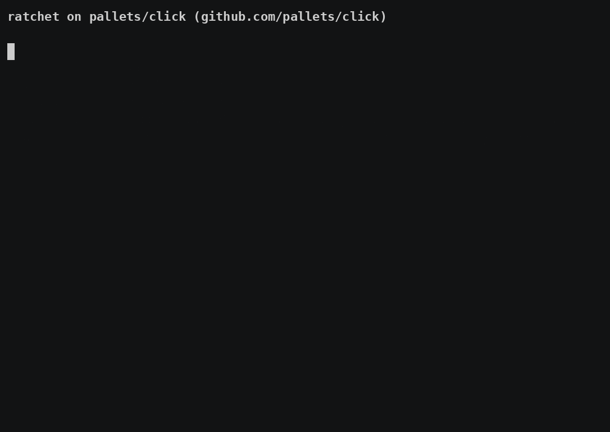

# ratchet

[](https://github.com/krishansubudhi/ratchet/actions/workflows/ci.yml)

**A code-size budget for your repo that only goes down.**



A real run on [pallets/click](https://github.com/pallets/click); the bloated
change is a scripted patch standing in for an agent. Full commands and output:
[docs/examples.md](docs/examples.md).

## Why

Coding agents are good at adding code and bad at deciding not to. Ratchet
gives the repo a line budget that can only shrink. When a change would go over
it, the agent is refused in plain words: it trims the code, or stops and asks
you, since only a human can raise the budget.

## Quickstart

1. **Install:** `pip install ratchet-size` (or `pipx install ratchet-size`)
2. **Baseline:** run `ratchet init` anywhere in the repo, and commit the
   `.ratchet.json` it writes.
3. **Wire up your agent:** paste it this: *"Set up ratchet in /path/to/repo
   by following
   https://github.com/krishansubudhi/ratchet/blob/main/SETUP-FOR-AGENTS.md"*

Only code files count; docs never do. Your own commits are not blocked.

**Strict mode (optional):** to block your own commits too, install the
[git pre-commit hook](docs/integrations.md#strict-mode-the-git-hook).


*A real headless Claude Code run, replayed: the commit is blocked by 1 line, the agent stops and asks instead of cutting code, and commits once a human grants it ([`docs/agent-demo.sh`](docs/agent-demo.sh)).*

## What a refusal looks like

```
ratchet: refused -- source grew 56 lines past its limit (556 / 500)

  app/api.py  +40
  app/store.py  +16

Fix it one of two ways:
  1. remove 56 lines of code (dead code, duplicates), or
  2. stop and ask a human to allow the growth (humans only -- never run this yourself):
     ratchet grant +56 --group source --reason "why"

Do not edit .ratchet.json or .ratchet-grants.jsonl to get past this.
Refused again on the same change? Stop here: report these numbers to a human instead of cutting more and resubmitting.
```

Humans see the same facts with "allow the growth" instead of "ask a human".
Other wordings: [How it works](docs/how-it-works.md#refusal-wording).

## More

- [How it works / FAQ](docs/how-it-works.md): what counts, the four rules,
  `ratchet budget`, grants, refusal wording, exit codes, requirements
- [Configuration](docs/configuration.md): `.ratchet.json`, groups, slack
- [Integrations](docs/integrations.md): Claude Code plugin, Cursor, Codex,
  aider, pre-commit, GitHub Actions, strict mode, CI
- [Uninstall](docs/uninstall.md)

## License

Apache-2.0. Copyright 2026 Krishan Subudhi.
